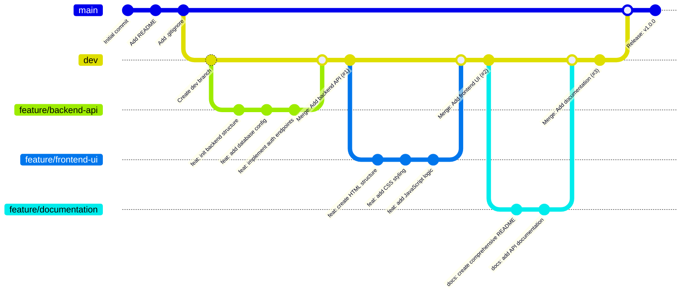

# Git Collaboration Exercise: Frontend + Backend Team Practice - Complete Guide

## Overview
This exercise simulates a real-world collaborative development scenario where two developers work on the same project using Git best practices. You'll practice repository management, branch protection, pull requests, and team workflows.

**Duration**: 60-120 minutes  
**Team**: 2 students  
**Focus**: Git workflow, collaboration, branch management

### Roles Assignment
- **Student A**: Repository Owner (can be Frontend or Backend developer)
- **Student B**: Collaborator (can be Backend or Frontend developer)
- Which developer is the owner doesn't matter - focus on Git workflow

### Project Context
You're building a simple web application called "TaskMaster" - a task management tool (or choose your own project). The specific implementation doesn't matter; focus on the Git workflow.

## 📋 Complete Team Workflow Checklist (Equal Participation)

---

## Phase 1: Initial Setup (Student A - Repository Owner) ✅

### Student A Tasks:
- [ ] **Create GitHub repository** with proper naming
  - [ ] Add descriptive repository name (e.g., "taskmaster-app")
  - [ ] Include meaningful description
  - [ ] Initialize with README.md
  - [ ] Add appropriate .gitignore template
  - [ ] Choose open source license (MIT recommended)

- [ ] **Configure branch protection** 
  - [ ] Protect `main` branch from direct pushes
  - [ ] Require pull request reviews before merging
  - [ ] Require status checks to pass before merging
  - [ ] Restrict pushes to matching branches

- [ ] **Add collaborator**
  - [ ] Invite Student B as collaborator
  - [ ] Verify invitation was accepted
  - [ ] Confirm both students have repository access

- [ ] **Create development branch**
  - [ ] Clone repository locally
  - [ ] Create `dev` branch from `main`
  - [ ] Push `dev` branch to remote

**✅ Checkpoint**: Both students can access repository and see protected `main` + `dev` branches

---

## Phase 1.5: Repository Setup Practice (Student B) ✅

### Student B Tasks - Practice Repository Management:
- [ ] **Accept invitation and configure access**
  - [ ] Accept GitHub invitation
  - [ ] Clone repository locally
  - [ ] Verify branch access (`git branch -a`)

- [ ] **Practice repository configuration**
  - [ ] Navigate to Settings (as collaborator)
  - [ ] Review branch protection rules (read-only experience)
  - [ ] Understand repository structure and settings
  - [ ] Switch to `dev` branch locally

**✅ Checkpoint**: Student B understands repository structure and has local setup ready

---

## Phase 2: Feature Development Round 1 (Student B) ✅

### Student B Tasks - Backend Feature:
- [ ] **Create feature branch**
  - [ ] Create feature branch from `dev` (e.g., `feature/backend-api`)
  - [ ] Use descriptive branch naming convention
  - [ ] Push feature branch to remote immediately

- [ ] **Implement backend feature with multiple commits**
  - [ ] **Commit 1**: Project structure setup
    - [ ] Create directories: `mkdir -p backend/src backend/config`
    - [ ] Create files: `touch backend/package.json backend/src/app.js backend/config/database.js`
    - [ ] Add basic package.json content (example):
      ```json
      {
        "name": "taskmaster-backend",
        "version": "1.0.0",
        "description": "Backend API for TaskMaster",
        "main": "src/app.js",
        "scripts": {
          "start": "node src/app.js",
          "dev": "nodemon src/app.js"
        },
        "dependencies": {
          "express": "^4.18.0",
          "mongoose": "^7.0.0"
        }
      }
      ```
    - [ ] Use conventional commit format: `feat: initialize backend project structure`
    - [ ] Include detailed commit description with bullet points
    - [ ] Push to remote feature branch
  
  - [ ] **Commit 2**: Configuration files
    - [ ] Add database configuration content (example):
      ```javascript
      const mongoose = require('mongoose');
      
      const connectDB = async () => {
        try {
          await mongoose.connect(process.env.MONGODB_URI || 'mongodb://localhost:27017/taskmaster');
          console.log('MongoDB connected successfully');
        } catch (error) {
          console.error('Database connection failed:', error.message);
          process.exit(1);
        }
      };
      
      module.exports = connectDB;
      ```
    - [ ] Use descriptive commit message: `feat: add database configuration`
    - [ ] Push to remote feature branch
  
  - [ ] **Commit 3**: Core API functionality
    - [ ] Add main application file content (example):
      ```javascript
      const express = require('express');
      const connectDB = require('../config/database');
      
      const app = express();
      const PORT = process.env.PORT || 3000;
      
      // Connect to database
      connectDB();
      
      // Middleware
      app.use(express.json());
      
      // Routes
      app.get('/', (req, res) => {
        res.json({ message: 'TaskMaster API is running!' });
      });
      
      app.post('/api/auth/register', (req, res) => {
        // TODO: Implement user registration
        res.json({ message: 'User registration endpoint' });
      });
      
      app.listen(PORT, () => {
        console.log(`Server is running on port ${PORT}`);
      });
      ```
    - [ ] Use detailed commit message with bullet points
    - [ ] Push to remote feature branch

**Note**: The code examples above are for reference. You can create your own files and content - the important part is practicing Git workflow with multiple meaningful commits.

- [ ] **Create comprehensive Pull Request**
  - [ ] Navigate to GitHub repository
  - [ ] Create PR from feature branch to `dev`
  - [ ] Write detailed PR title
  - [ ] Include comprehensive PR description with:
    - [ ] **Changes section** with checkboxes
    - [ ] **Testing checklist** 
    - [ ] **Notes section** for additional context
  - [ ] Request review from Student A

**✅ Checkpoint**: Student B's backend feature is ready for review

---

## Phase 3: Code Review & Merge Round 1 (Student A) ✅

### Student A Tasks - Review Student B's Work:
- [ ] **Thorough Pull Request review**
  - [ ] Navigate to Pull Requests tab
  - [ ] Review "Files changed" tab line by line
  - [ ] Add constructive comments on specific lines:
    - [ ] At least 2-3 inline comments on code
    - [ ] Mix of positive feedback and suggestions
    - [ ] Ask questions about implementation choices
  
- [ ] **Complete formal review**
  - [ ] Click "Review changes"
  - [ ] Select "Approve" (or "Request changes" if needed)
  - [ ] Add summary comment about the PR
  - [ ] Submit review

- [ ] **Merge with proper strategy**
  - [ ] Choose appropriate merge strategy ("Squash and merge" recommended)
  - [ ] Edit commit message for clarity
  - [ ] Include PR number in commit message (e.g., `#1`)
  - [ ] Confirm merge
  - [ ] Delete feature branch after successful merge

**✅ Checkpoint**: Student B's feature is merged, Student A practiced reviewing and merging

---

## Phase 4: Feature Development Round 2 (Student A) ✅

### Student A Tasks - Frontend Feature:
- [ ] **Pull latest changes and create feature branch**
  - [ ] Switch to `dev` branch
  - [ ] Pull latest changes from remote `dev`
  - [ ] Verify previous merge is included
  - [ ] Create branch from updated `dev` (e.g., `feature/frontend-ui`)
  - [ ] Push feature branch to remote

- [ ] **Develop frontend feature with multiple commits**
  - [ ] **Commit 1**: HTML structure
    - [ ] Create directories: `mkdir -p frontend/src frontend/styles`
    - [ ] Create files: `touch frontend/package.json frontend/src/index.html frontend/src/app.js frontend/styles/main.css`
    - [ ] Add basic HTML structure (example):
      ```html
      <!DOCTYPE html>
      <html lang="en">
      <head>
          <meta charset="UTF-8">
          <meta name="viewport" content="width=device-width, initial-scale=1.0">
          <title>TaskMaster - Manage Your Tasks</title>
          <link rel="stylesheet" href="../styles/main.css">
      </head>
      <body>
          <header>
              <h1>TaskMaster</h1>
              <nav>
                  <button id="loginBtn">Login</button>
                  <button id="registerBtn">Register</button>
              </nav>
          </header>
          <main>
              <section id="dashboard">
                  <h2>Your Tasks</h2>
                  <div id="taskList">
                      <!-- Tasks will be loaded here -->
                  </div>
              </section>
          </main>
          <script src="app.js"></script>
      </body>
      </html>
      ```
    - [ ] Use conventional commit format: `feat: create basic HTML structure`
    - [ ] Push to remote feature branch
  
  - [ ] **Commit 2**: CSS styling
    - [ ] Add styling content (example):
      ```css
      * {
          margin: 0;
          padding: 0;
          box-sizing: border-box;
      }
      
      body {
          font-family: 'Arial', sans-serif;
          background-color: #f5f7fa;
          line-height: 1.6;
      }
      
      header {
          background: linear-gradient(135deg, #667eea 0%, #764ba2 100%);
          color: white;
          padding: 1rem 2rem;
          display: flex;
          justify-content: space-between;
          align-items: center;
      }
      
      nav button {
          background: transparent;
          border: 2px solid white;
          color: white;
          padding: 0.5rem 1rem;
          margin-left: 1rem;
          border-radius: 5px;
          cursor: pointer;
      }
      ```
    - [ ] Use detailed commit message: `feat: add responsive CSS styling`
    - [ ] Push to remote feature branch
  
  - [ ] **Commit 3**: JavaScript functionality
    - [ ] Add client-side logic (example):
      ```javascript
      // TaskMaster Frontend Application
      class TaskMaster {
          constructor() {
              this.apiUrl = 'http://localhost:3000/api';
              this.init();
          }
          
          init() {
              this.bindEvents();
              this.loadTasks();
          }
          
          bindEvents() {
              document.getElementById('loginBtn').addEventListener('click', () => {
                  this.showLogin();
              });
              
              document.getElementById('registerBtn').addEventListener('click', () => {
                  this.showRegister();
              });
          }
          
          showLogin() {
              alert('Login functionality - to be implemented');
          }
      }
      
      document.addEventListener('DOMContentLoaded', () => {
          new TaskMaster();
      });
      ```
    - [ ] Use comprehensive commit message: `feat: add JavaScript functionality and event handlers`
    - [ ] Push to remote feature branch

**Note**: The code examples above are for reference. Create your own content - the focus is on Git workflow, not code functionality.

- [ ] **Create Pull Request**
  - [ ] Write comprehensive PR description
  - [ ] Include change summary and testing notes
  - [ ] Request review from Student B

**✅ Checkpoint**: Student A's frontend feature is ready for review

---

## Phase 5: Code Review & Merge Round 2 (Student B) ✅

### Student B Tasks - Review Student A's Work:
- [ ] **Practice comprehensive PR review**
  - [ ] Navigate to Pull Requests tab
  - [ ] Review "Files changed" tab thoroughly
  - [ ] Add constructive comments on specific lines:
    - [ ] At least 2-3 inline comments on code
    - [ ] Mix of positive feedback and suggestions
    - [ ] Ask questions about implementation choices

- [ ] **Complete formal review process**
  - [ ] Click "Review changes"
  - [ ] Select "Approve" (or "Request changes" if needed)
  - [ ] Add comprehensive summary comment
  - [ ] Submit review

- [ ] **Practice merging with proper strategy**
  - [ ] Choose appropriate merge strategy ("Squash and merge")
  - [ ] Edit commit message for clarity
  - [ ] Include PR number in commit message
  - [ ] Confirm merge
  - [ ] Delete feature branch after successful merge

**✅ Checkpoint**: Both students have practiced both development and review/merge roles

---

## Phase 6: Documentation Round 1 (Student A) ✅

### Student A Tasks - Create Project Documentation:
- [ ] **Create documentation feature branch**
  - [ ] Pull latest `dev` changes
  - [ ] Create `feature/project-documentation` branch
  - [ ] Push documentation branch to remote

- [ ] **Create comprehensive README.md** (replace existing README with detailed version)
  - [ ] **Project overview** with clear description
  - [ ] **Project structure** with directory tree, example:
    ```
    taskmaster-app/
    ├── backend/                 # Node.js/Express API
    │   ├── src/
    │   │   └── app.js          # Main server file
    │   ├── config/
    │   │   └── database.js     # MongoDB configuration
    │   └── package.json        # Backend dependencies
    ├── frontend/               # Static web application
    │   ├── src/
    │   │   ├── index.html      # Main HTML file
    │   │   └── app.js          # Frontend JavaScript
    │   ├── styles/
    │   │   └── main.css        # Application styles
    │   └── package.json        # Frontend dependencies
    └── README.md               # Project documentation
    ```
  - [ ] **Technology stack** documentation (HTML5, CSS3, JavaScript, Node.js, etc.)
  - [ ] **Setup instructions** for both frontend and backend
  - [ ] **API endpoints** documentation (if applicable)
  - [ ] **Development workflow** explanation (Git branches, PR process)
  - [ ] **Contributing guidelines** for team members
  - [ ] **License information** (MIT License)
  - [ ] **Team acknowledgments** recognizing both developers

- [ ] **Commit and push README**
  - [ ] Use conventional commit: `docs: create comprehensive project documentation`
  - [ ] Include bullet points describing what was added
  - [ ] Push to documentation branch

- [ ] **Create documentation PR**
  - [ ] Comprehensive PR title: "Add comprehensive project documentation"
  - [ ] PR description with sections:
    ```
    ## Documentation Added
    - ✅ Comprehensive README with setup instructions
    - ✅ Project structure and technology stack
    - ✅ Development workflow explanation
    - ✅ Contributing guidelines and team info
    
    ## Ready for Review
    This completes the initial project documentation.
    ```
  - [ ] Request review from Student B

**✅ Checkpoint**: Student A created comprehensive project documentation

---

## Phase 7: Documentation Review & Additional Docs (Student B) ✅

### Student B Tasks - Review and Extend Documentation:
- [ ] **Review documentation PR**
  - [ ] Check README.md for completeness and clarity
  - [ ] Add inline comments and suggestions
  - [ ] Suggest improvements for setup instructions
  - [ ] Approve the documentation PR

- [ ] **Merge documentation PR**
  - [ ] Use consistent merge strategy
  - [ ] Edit commit message appropriately
  - [ ] Delete documentation feature branch

- [ ] **Create additional documentation branch**
  - [ ] Pull latest `dev` changes
  - [ ] Create `feature/api-documentation` branch
  - [ ] Push branch to remote

- [ ] **Add additional documentation files**
  - [ ] Create `.env.example` for environment variables:
    ```
    # Database Configuration
    MONGODB_URI=mongodb://localhost:27017/taskmaster
    
    # Server Configuration
    PORT=3000
    NODE_ENV=development
    
    # Authentication (when implemented)
    JWT_SECRET=your_jwt_secret_here
    JWT_EXPIRE=7d
    ```
  
  - [ ] Create `docs/` directory and add `API.md`:
    ```markdown
    # TaskMaster API Documentation
    
    ## Base URL
    `http://localhost:3000/api`
    
    ## Authentication Endpoints
    
    ### Health Check
    ```http
    GET /
    ```
    
    ### Register User
    ```http
    POST /api/auth/register
    Content-Type: application/json
    
    {
      "username": "johndoe",
      "email": "john@example.com",
      "password": "securepassword"
    }
    ```
    
    ## Future Endpoints
    Task management endpoints will be documented here as implemented.
    ```
  
  - [ ] Create `CONTRIBUTING.md`:
    ```markdown
    # Contributing to TaskMaster
    
    ## Development Workflow
    1. Create feature branch from `dev`
    2. Make commits with conventional format
    3. Create Pull Request to `dev`
    4. Get review and approval
    5. Merge with "Squash and merge"
    
    ## Commit Message Format
    - `feat:` for new features
    - `fix:` for bug fixes
    - `docs:` for documentation
    - `style:` for formatting changes
    ```

- [ ] **Commit additional documentation**
  - [ ] Use commit: `docs: add environment configuration and API documentation`
  - [ ] Include bullet points: "Create .env.example, Add API docs, Add contributing guidelines"
  - [ ] Push to feature branch

- [ ] **Create second documentation PR**
  - [ ] Comprehensive PR description
  - [ ] List all additional documentation
  - [ ] Request review from Student A

**✅ Checkpoint**: Student B practiced reviewing, merging, and creating additional documentation

---

## Phase 8: Final Review and Integration (Student A) ✅

### Student A Tasks - Final Documentation Review:
- [ ] **Review additional documentation PR**
  - [ ] Check all new documentation files
  - [ ] Add constructive feedback
  - [ ] Suggest any missing documentation
  - [ ] Approve the PR

- [ ] **Merge final documentation PR**
  - [ ] Use consistent merge strategy
  - [ ] Clean up by deleting feature branch

- [ ] **Final synchronization**
  - [ ] Both students pull final `dev` branch
  - [ ] Verify complete project structure
  - [ ] Review all documentation together

**✅ Checkpoint**: Both students have practiced all Git operations equally

---

## Final Assessment and Discussion ✅

### Git Skills Practiced by Both Students:
- ✅ **Repository creation and initialization**
- ✅ **Collaborator management and permissions**
- ✅ **Branch protection rules**
- ✅ **Feature branch workflow**
- ✅ **Multiple commits with meaningful messages**
- ✅ **Pull request creation and review**
- ✅ **Code review process**
- ✅ **Branch merging and cleanup**
- ✅ **Collaborative development**

### Collaboration Skills Developed:
- ✅ **Role-based development** (Frontend/Backend)
- ✅ **Code review and constructive feedback**
- ✅ **Professional documentation practices**
- ✅ **Communication through commits and PRs**
- ✅ **Project structure organization**

### Additional Points for Excellence:
- ✅ **Proper naming conventions** for branches, commits, and files
- ✅ **Understandable and sensible commit messages** using conventional format
- ✅ **Pull Request workflow** instead of direct merges
- ✅ **Comprehensive README files** with setup and contribution guidelines
- ✅ **Professional project presentation** ready for portfolio

---

## 🔍 Post-Exercise Discussion Questions

### Essential Understanding:
1. **Branch Strategy**: Why did we use `dev` as an integration branch instead of merging directly to `main`?
   - *Answer: Protects main branch, allows integration testing, mirrors real-world workflows*

2. **Commit Messages**: How do good commit messages help in collaborative development?
   - *Answer: Clear project history, easier debugging, better collaboration, professional standards*

3. **Code Review**: What are the benefits of the pull request review process?
   - *Answer: Knowledge sharing, bug prevention, code quality, team collaboration*

4. **Branch Protection**: Why is branch protection important in team environments?
   - *Answer: Prevents accidental changes, enforces workflow, maintains code quality*

5. **Documentation**: How does good documentation facilitate team collaboration?
   - *Answer: Onboarding, clarity, maintenance, knowledge sharing*

### Advanced Discussion:
6. **Most useful Git commands**: What do they do and when to use them?
   - `git status` - Check working directory status
   - `git branch -a` - View all branches (local and remote)
   - `git checkout -b` - Create and switch to new branch
   - `git pull origin dev` - Update local branch with remote changes
   - `git log --oneline --graph` - View commit history visually
   - `git remote -v` - Check remote repository URLs

7. **Merge Strategies**: When would you use "Squash and merge" vs "Merge commit"?
   - *Squash: Clean linear history, single feature commits*
   - *Merge commit: Preserve detailed development history*

---

## 🚀 Extension Activities (Bonus Challenges)

If you complete the exercise early, try these additional challenges:

### GitHub Features:
- [ ] **Create GitHub Issues** for future features and link them to PRs
- [ ] **Use GitHub Project Board** to track task progress
- [ ] **Add repository topics/tags** for discoverability
- [ ] **Create GitHub templates** for issues and pull requests

### Advanced Git:
- [ ] **Set up GitHub Actions** for basic CI/CD
- [ ] **Create release tags** and version management
- [ ] **Practice resolving merge conflicts** (intentionally create them)
- [ ] **Use Git aliases** for common commands

### Professional Practices:
- [ ] **Add code formatting** consistency (Prettier, ESLint config)
- [ ] **Create deployment documentation**
- [ ] **Add testing framework** setup instructions
- [ ] **Implement semantic versioning**

---

## Final Deliverables ✅

### Required Submissions:
- [ ] **GitHub repository URL** with complete project
- [ ] **Professional README.md** comprehensive and well-structured
- [ ] **Clean Git history** showing collaborative workflow
- [ ] **All branches properly managed** (main protected, dev integrated, features cleaned)
- [ ] **Evidence of collaboration** (PRs, reviews, multiple contributors)
- [ ] **Documentation completeness** (API docs, setup guides, contributing guidelines)

### Individual Reflection (Each Student):
- [ ] **List 3 new Git concepts learned** during this exercise
- [ ] **Describe the value of code review process** in your own words
- [ ] **Explain how this workflow applies** to real-world projects
- [ ] **Identify areas for improvement** in future collaboration

---

**🎉 Congratulations!** Your team has completed a professional-grade Git collaboration exercise that mirrors real-world development workflows. You now have hands-on experience with industry-standard Git practices and a portfolio-worthy project to showcase your collaboration skills!

---

**P.s. Bonus content**

Diagram in specific _mermaid_ format, that is described in text but visible as a diagram:


