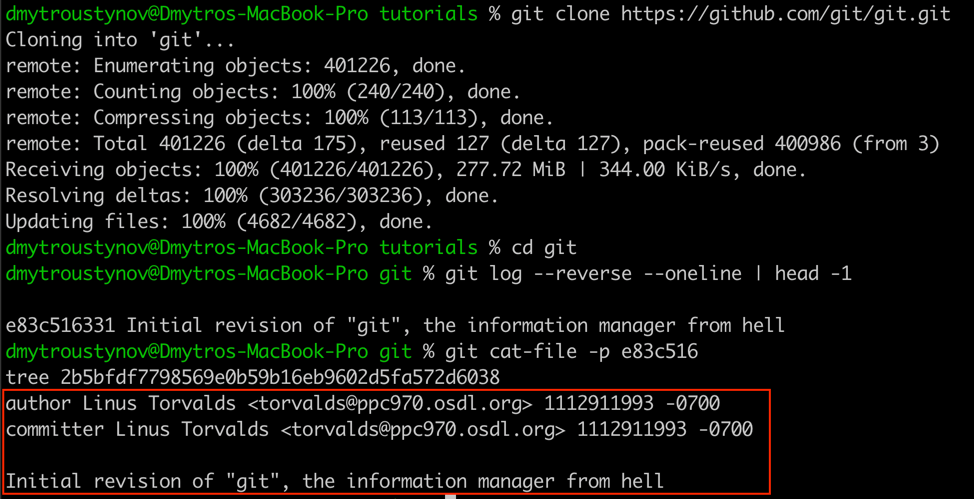

# Git Under the Hood

This isn't about Git commands, or what's the difference between merge and rebase.

This is about how Git actually works under the hood, what makes it so powerful, and how this incredible technology changed the IT world.

If you want to understand Git deeply, read on.

## Table of Contents

1. [Objects](#objects)
   - What are Git Objects?
   - Investigating Git Objects
   - Understanding Object Storage
   - Quick Reference Commands

2. [Interesting Discovery](#interesting)
   - Git's Own Repository
   - Finding the First Commit

3. [Branches](#branches)
   - What is a Branch?
   - Switching Branches

4. [Differences](#differences)
   - How Git Detects Changes
   - When Changes Merge Cleanly
   - When Conflicts Occur
   - The Three-Way Merge Algorithm

5. [Understanding Remotes](#understanding-remotes)
   - The Four States of Your Changes
   - How Git Tracks Remote Branches
   - Remote Operations
   - Diverging Histories
   - Tracking Branches
   - Git Stash
   - Git Patches
   - Shelve (IDE Feature)

---

## Objects

What Git does is track your file changes. It stores the state of the filesystem at every particular moment in time.

It makes "snapshots" of the current filesystem state and keeps them forever in history, so you can always reproduce that state.

And those points in time are commits. Each commit is a snapshot that stores the following information:

- **Who** - the author who made the commit (name and email)
- **What** - the complete state of all tracked files at that moment
- **When** - the timestamp marking when this snapshot was created
- **Parent** - a reference to the previous commit, linking them together in a chain of history
- **Message** - a description explaining what changed and why

This parent-child relationship creates an unbroken thread of consecutive changes, forming the complete history of your project. 

At first glance, storing a complete snapshot at every point in time might seem wasteful and redundant. But Git is smarter than that.

Git doesn't store duplicate files. If a file remains unchanged between commits, it isn't saved again. Instead, Git computes a hash of the file's content. When the content is identical, the hash stays the same, and no new object is created. The new commit simply references the existing object.

Only when a file (or directory structure) actually changes does Git create a new object. This content-addressable storage system makes Git incredibly efficient, even with thousands of commits in your history. 

### What are Git Objects?

Git stores everything as objects in the `.git/objects` directory. There are four types:

1. **Blob** - stores file content (binary large object)
2. **Tree** - stores directory structure and filenames
3. **Commit** - stores metadata about a snapshot (author, date, message, parent commits)
4. **Tag** - stores a reference to a specific commit with additional metadata

Each object is identified by a 40-character SHA-1 hash. Git uses the first 2 characters as a directory name and the remaining 38 as the filename in `.git/objects/`.

### Investigating Git Objects

Let's explore how to investigate objects in your repository.

#### Finding Object Hashes

To see all objects in your repository:
```bash
find .git/objects -type f
```

This shows the directory structure like:
```
.git/objects/3a/f7e8c2b1d9e4f5a6b7c8d9e0f1a2b3c4d5e6f7
.git/objects/5b/9c8d7e6f5a4b3c2d1e0f9a8b7c6d5e4f3a2b1c
```

The full hash is: `3af7e8c2b1d9e4f5a6b7c8d9e0f1a2b3c4d5e6f7`

#### Examining Object Type

Use `git cat-file` to investigate objects:
```bash
git cat-file -t <hash>
```

Example:
```bash
git cat-file -t 3af7e8c2
# Output: blob
```

The `-t` flag returns the object type: blob, tree, commit, or tag.

#### Reading Object Content

To see the actual content of an object:
```bash
git cat-file -p <hash>
```

The `-p` flag "pretty-prints" the content based on the object type.

**For a blob** (file content):
```bash
git cat-file -p 3af7e8c2
# Output: actual file content
print("Hello, Git!")
```

**For a tree** (directory listing):
```bash
git cat-file -p d9c6f5a2
# Output:
100644 blob acda80c872cc1a02a5c1f393606fcc38382c1265    README.md
040000 tree 99b9288f5a377293b4ab4c0bf2cf0847755b0105    bash-scripts
040000 tree 1ab6709985ecf1656dc590dfc3bef9762d25a699    images
```

**For a commit**:
```bash
git cat-file -p 25b91ef8
# Output:
tree d9c6f5a247d60963db476111ba2eb942d335511d
parent 458fe8414a9dc483153f5e3a48f98edfd5fb0ec3
author Dmytro <email@example.com> 1730965921 +0200
committer Dmytro <email@example.com> 1730965921 +0200

Update README.md
```

### Getting Object Size

To see how much space an object takes:
```bash
git cat-file -s <hash>
# Output: 156
```

### Practical Example: Tracing a File Through History

Let's trace how Git stores a specific file:

1. **Find the current commit hash**:
```bash
git log --oneline
# a1b2c3d Latest changes
```

2. **Examine the commit object**:
```bash
git cat-file -p a1b2c3d
# Shows the tree hash
```

3. **Examine the tree object**:
```bash
git cat-file -p <tree-hash>
# Shows blob hash for your file
```

4. **Read the file content**:
```bash
git cat-file -p <blob-hash>
# Shows actual file content
```

### Understanding Object Storage

Git compresses objects using zlib compression. The raw format before compression is:

```
<type> <size>\0<content>
```

For example, a blob containing "Hello" would be stored as:
```
blob 5\0Hello
```

Then Git computes the SHA-1 hash of this content and compresses it with zlib.

### Quick Reference Commands

```bash
# Show object type
git cat-file -t <hash>

# Show object content
git cat-file -p <hash>

# Show object size
git cat-file -s <hash>

# List all objects
find .git/objects -type f

# Show commit history with full hashes
git log --format="%H %s"

# Show what commit HEAD points to
git rev-parse HEAD
```

Understanding these objects is fundamental to understanding how Git works under the hood. Every commit is just a pointer to a tree, every tree is a list of blobs and other trees, and blobs are your actual file contents.

## Interesting...

By the way, did you know that Git has its own repository on GitHub?

You can find it here: https://github.com/git/git.git 

And even see the very first commit made by Linus Torvalds himself:



```bash
git clone https://github.com/git/git.git
cd git

# Find the first commit
git log --reverse --oneline | head -1

# View its contents
git cat-file -p e83c516
# Output:
tree 2b5bfdf7798569e0b59b16eb9602d5fa572d6038
author Linus Torvalds <torvalds@ppc970.osdl.org> 1112911993 -0700
committer Linus Torvalds <torvalds@ppc970.osdl.org> 1112911993 -0700

Initial revision of "git", the information manager from hell 
```

This commit was made on April 6, 2005, at 20:53:13 PST. The beginning of a revolution.

## Branches 

Now you understand that every commit is a filesystem snapshot, allowing you to restore the state of files and folders from any point in history. Git simply reads the content of those snapshots and reconstructs the file structure.

Each commit contains complete information about the filesystem state: what changed, when it was made, who made it, and crucially, a reference to its parent commit. This parent reference is the key to understanding branches.

So what is a branch? Surprisingly simple: a branch is just two commits that point to the same parent commit. That's it! When you create a branch, you're creating a new line of development that diverges from a common ancestor. Both the original branch and the new branch continue from that shared parent, each carrying their own subsequent changes forward independently.

When you switch branches with `git checkout <branch_name>`, Git simply restores the filesystem from that branch's latest commit.

## Differences

One of the most incredible parts of Git is how it intelligently handles differences between versions. When you merge branches or compare commits, Git doesn't just look at files as whole units—it analyzes them line by line.

### How Git Detects Changes

Git uses a three-way merge algorithm to understand what changed. When merging two branches, Git compares:

1. **Base** - the common ancestor commit (the parent both branches share)
2. **Ours** - the changes in your current branch
3. **Theirs** - the changes in the branch you're merging in

By comparing all three versions, Git can determine which changes came from which branch and whether they conflict.

### When Changes Merge Cleanly

Git can automatically merge changes when they don't overlap:

**Example: Different files changed**
```
Base:    file1.txt, file2.txt
Ours:    file1.txt (modified), file2.txt
Theirs:  file1.txt, file2.txt (modified)
Result:  Both modifications applied ✓
```

**Example: Different parts of the same file**
```
Base:
    line 1: def hello():
    line 2:     print("Hello")
    line 3:     return True

Ours (changed line 2):
    line 1: def hello():
    line 2:     print("Hello, World!")
    line 3:     return True

Theirs (changed line 3):
    line 1: def hello():
    line 2:     print("Hello")
    line 3:     return False

Result: Both changes applied ✓
    line 1: def hello():
    line 2:     print("Hello, World!")
    line 3:     return False
```

### When Conflicts Occur

A conflict happens when both branches modify the same lines in the same file. Git can't automatically decide which version to keep because it doesn't understand the semantic meaning of your code—it only sees text.

**Example: Conflicting changes**
```
Base:
    line 5: status = "pending"

Ours:
    line 5: status = "approved"

Theirs:
    line 5: status = "rejected"

Result: CONFLICT! ✗
```

Git marks the conflict in the file like this:
```
<<<<<<< HEAD
status = "approved"
=======
status = "rejected"
>>>>>>> feature-branch
```

You must manually decide which version to keep (or combine them somehow) because Git can't know your intent.

### Why Git is Smart About This

Git's diff algorithm (based on the Myers diff algorithm) is remarkably efficient:

- It finds the **longest common subsequence** between versions
- It minimizes the number of changes needed to transform one version into another
- It operates line-by-line, making it language-agnostic
- It can detect when entire blocks of code are moved, not just changed

### Checking for Conflicts Before Merging

You can preview potential conflicts:

```bash
# See what would change
git diff branch1..branch2

# See what files differ
git diff --name-only branch1 branch2

# Find the common ancestor
git merge-base branch1 branch2
```

### The Three-Way Merge in Action

When you run `git merge feature-branch`, Git:

1. Finds the common ancestor commit
2. Compares each file against both branch versions
3. For each line, decides:
   - If only one branch changed it → use that change
   - If both branches changed it the same way → use that change
   - If both branches changed it differently → mark as conflict
4. Creates a new merge commit with two parents

This is why understanding commits as snapshots is crucial—Git needs that common ancestor to know what the "original" state was before both branches diverged.

### Example: Visualizing the Merge

```
      A---B---C (main)
         \
          D---E (feature)
```

To merge `feature` into `main`:
- Common ancestor: A
- Compare each file: A vs C (main's changes) and A vs E (feature's changes)
- If main changed lines 1-5 and feature changed lines 10-15 → clean merge
- If both changed line 8 → conflict

The result:
```
      A---B---C---M (main)
         \       /
          D---E (feature)
```

Where M is a merge commit containing resolved changes from both branches.

## Understanding Remotes

Everything we've discussed so far has been about running Git locally, without any remote repository at all.

You can use Git without GitHub, GitLab, or any hosting service—just tracking your own progress on your local filesystem. Git was designed to work this way from the beginning.

But what makes Git truly revolutionary is its distributed architecture and collaborative capabilities. This transformed it from a version control tool into the technology that fundamentally changed how the entire IT world builds software.

### The Four States of Your Changes

When working with remotes, your code exists in multiple states simultaneously. Understanding these states is crucial:

**1. Working Directory (Unstaged Changes)**

These are modifications you've made to files that Git sees but hasn't started tracking yet. They exist only on your disk.

```bash
# See unstaged changes
git status
# Shows: "Changes not staged for commit"

# See what changed
git diff
```

**2. Staging Area (Staged Changes)**

Changes you've explicitly told Git to include in the next commit using `git add`. They're ready to be committed but not yet part of history.

```bash
# Stage changes
git add file.txt

# See staged changes
git diff --staged
```

**3. Local Repository (Committed Changes)**

Changes that are saved in your local Git history. They're permanent snapshots in your local `.git` directory but haven't been shared with anyone yet.

```bash
# Commit staged changes
git commit -m "Add feature"

# See commit history
git log
```

**4. Remote Repository (Pushed Changes)**

Changes that have been uploaded to a remote server (like GitHub). Now others can see and pull your work.

```bash
# Push to remote
git push origin main
```

### How Git Tracks Remote Branches

When you clone a repository, Git doesn't just copy files—it creates references to track both local and remote branches.

**Remote-tracking branches** are references to the state of branches on the remote repository. They're stored locally but you can't modify them directly. They update only when you fetch or pull from the remote.

```bash
# See all branches (local and remote)
git branch -a

# Output might show:
* main                    # your local branch
  feature                 # another local branch
  remotes/origin/main     # remote-tracking branch
  remotes/origin/feature  # another remote-tracking branch
```

### The Anatomy of Remote Operations

**Clone**: Copy the entire repository, including all history and branches
```bash
git clone https://github.com/user/repo.git
```

**Fetch**: Download new commits from remote, update remote-tracking branches, but don't merge anything
```bash
git fetch origin
# Now remotes/origin/main is updated, but your local main is unchanged
```

**Pull**: Fetch + Merge in one command
```bash
git pull origin main
# Equivalent to:
# git fetch origin
# git merge origin/main
```

**Push**: Upload your local commits to the remote
```bash
git push origin main
# Sends commits from local main to remote main
```

### Diverging Histories: When Local and Remote Differ

This is where Git's distributed nature shines. Consider this scenario:

```
# Your local repository
A---B---C---D (local main)

# Remote repository
A---B---E---F (origin/main)
```

Both you and a teammate committed after commit B. Now you have diverging histories. When you try to push:

```bash
git push origin main
# Error: Updates were rejected because the remote contains work you don't have
```

Git refuses because it can't fast-forward. You have two options:

**Option 1: Merge (creates a merge commit)**
```bash
git pull origin main  # Fetch + merge
# Result:
A---B---C---D---M (local main)
     \         /
      E---F (origin/main)

git push origin main  # Now it works
```

**Option 2: Rebase (replays your commits on top)**
```bash
git pull --rebase origin main
# Result:
A---B---E---F---C'---D' (local main)

git push origin main
```

Rebase creates a linear history by "replaying" your commits (C and D) on top of the remote commits (E and F). What rebase actually does is change the parent of your commits. The commits C' and D' have the same changes but different hashes because their parent changed.

**The important point**: C' and D' are NEW commits with different SHA-1 hashes than C and D, even though they contain the same changes. Why? Because the parent commit is part of what goes into calculating the commit hash.

This is why the golden rule exists: **never rebase commits that you've already pushed and others might be using**. You're literally rewriting history by creating new commits with different parents.

### Tracking Branches

When you create a local branch, you can set it to track a remote branch:

```bash
# Create and set up tracking
git checkout -b feature origin/feature

# Or set tracking for existing branch
git branch --set-upstream-to=origin/feature feature

# Now these commands know where to push/pull:
git pull   # pulls from origin/feature
git push   # pushes to origin/feature
```

You can see which branches track which remotes:
```bash
git branch -vv

# Output:
* main    abc123 [origin/main] Latest commit message
  feature def456 [origin/feature: ahead 2] Working on feature
```

"ahead 2" means you have 2 local commits not yet pushed.

### Git Stash: Temporary Storage for Uncommitted Work

Sometimes you need to switch branches but have uncommitted changes you're not ready to commit. This is where `stash` comes in—it's like a clipboard for your working directory.

**Basic stashing:**
```bash
# Save current changes and revert to clean state
git stash

# Or with a descriptive message
git stash save "WIP: implementing login feature"

# See all stashes
git stash list
# Output:
# stash@{0}: WIP: implementing login feature
# stash@{1}: On main: emergency fix
```

**Applying stashed changes:**
```bash
# Apply most recent stash and keep it in stash list
git stash apply

# Apply and remove from stash list
git stash pop

# Apply specific stash
git stash apply stash@{1}

# Delete a stash
git stash drop stash@{0}

# Clear all stashes
git stash clear
```

**Advanced stashing:**
```bash
# Stash including untracked files
git stash -u

# Stash only unstaged changes (keep staged changes)
git stash --keep-index

# Create a branch from a stash
git stash branch new-feature-branch stash@{0}
```

### What's in a Stash?

A stash is actually a special commit (or two commits) that Git creates:

1. One commit with your working directory changes
2. Another commit with your staged changes (if any)
3. A third commit (if you used `-u`) with untracked files

These commits aren't part of any branch—they're stored in `.git/refs/stash`. That's why you can apply them to any branch later.

And they're purely local and private. They live on your machine only. Your teammates can't see them, and they're not shared to the repository.

### Git Patches: Sharing Changes Without Commits

While stashes are private, sometimes you need to share uncommitted changes or specific commits with others without using the normal push/pull workflow. This is where patches come in.

A patch is a text file that describes the differences between two states of your code. It's the same format you see when you run `git diff`—a human-readable representation of what changed.

**Creating patches from uncommitted changes:**

```bash
# Create a patch from your current working directory changes
git diff > my-changes.patch

# Create a patch from staged changes
git diff --staged > my-staged-changes.patch

# Create a patch from a specific file
git diff path/to/file.py > file-changes.patch
```

**Creating patches from commits:**

```bash
# Create a patch from the last commit
git format-patch -1 HEAD

# This creates a file like: 0001-Your-commit-message.patch

# Create patches for the last 3 commits
git format-patch -3 HEAD

# Create patches for all commits in a branch
git format-patch main..feature-branch

# Create a single patch file for multiple commits
git format-patch main..feature-branch --stdout > all-changes.patch
```

**Creating a patch from a stash:**

```bash
# Export your stash as a patch file
git stash show -p stash@{0} > my-stash.patch

# Now you can email this file or share it however you want
```

**Applying patches:**

There are two ways to apply patches, depending on how they were created:

```bash
# Method 1: Using git apply (for simple diffs)
git apply my-changes.patch

# Check if a patch will apply cleanly first
git apply --check my-changes.patch

# Apply with more context to handle minor differences
git apply -3 my-changes.patch
```

```bash
# Method 2: Using git am (for patches from format-patch)
git am 0001-Your-commit-message.patch

# This actually creates a commit with original author and message

# Apply multiple patches at once
git am *.patch
```

**What's inside a patch file?**

A simple patch from `git diff` looks like this:

```diff
diff --git a/hello.py b/hello.py
index 3af7e8c..9d8c7b6 100644
--- a/hello.py
+++ b/hello.py
@@ -1,3 +1,4 @@
 def greet(name):
-    print("Hello")
+    print(f"Hello, {name}!")
+    return True
```

A patch from `git format-patch` includes commit metadata:

```diff
From 3af7e8c2b1d9e4f5a6b7c8d9e0f1a2b3c4d5e6f7 Mon Sep 17 00:00:00 2001
From: Dmytro <dmytro@example.com>
Date: Sun, 16 Nov 2025 10:30:00 +0200
Subject: [PATCH] Improve greeting function

Add personalization to greeting and return success status.
---
 hello.py | 3 ++-
 1 file changed, 2 insertions(+), 1 deletion(-)

diff --git a/hello.py b/hello.py
index 3af7e8c..9d8c7b6 100644
--- a/hello.py
+++ b/hello.py
@@ -1,3 +1,4 @@
 def greet(name):
-    print("Hello")
+    print(f"Hello, {name}!")
+    return True
```

**When to use patches:**

1. **Code review without Git access** - Send patches via email for review (this is how Linux kernel development works!)
2. **Contributing to projects** - Some projects accept patches instead of pull requests
3. **Sharing work-in-progress** - Send uncommitted changes to a colleague
4. **Backup specific changes** - Save your work before trying something risky
5. **Working across disconnected systems** - Move changes between machines without network access
6. **Applying someone else's stash** - Export your stash and someone else can apply it

**Practical example: Sharing a stash with a teammate**

```bash
# You (Person A):
git stash save "Fix for login bug"
git stash show -p stash@{0} > login-fix.patch
# Send login-fix.patch to teammate via email/Slack

# Your teammate (Person B):
# Receives login-fix.patch
git apply login-fix.patch
# Now they have your changes in their working directory!
```

**Patches vs Pull Requests:**

- **Patches**: Simple text files, work anywhere, email-friendly, no GitHub needed
- **Pull Requests**: Integrated with hosting platform, easier collaboration, automated testing

Both achieve the same goal—sharing code changes—but patches are more portable and work without any web service.

### Shelve (IntelliJ/PyCharm Feature)

While `git stash` is a Git feature, IDEs like IntelliJ IDEA and PyCharm have a similar concept called "Shelve":

**Differences from stash:**
- Shelve is IDE-specific, not a Git command
- Changes are stored in IDE configuration, not in `.git`
- You can selectively shelve specific files or even specific lines
- Shelves are named and organized in the IDE UI
- Shelves persist across Git operations and are more permanent

**When to use Shelve vs Stash:**
- **Stash**: Quick temporary storage, sharing with others via patches, Git-native workflow
- **Shelve**: Long-term storage of experimental changes, IDE-integrated workflow, fine-grained selection

Both serve the same purpose: temporarily setting aside changes without committing them. Choose based on your workflow and whether you need Git integration or IDE features.

### The Complete Picture

Here's how all these pieces fit together in a typical workflow:

```bash
# 1. Working on feature
vim feature.py
git status  # Shows: modified: feature.py (unstaged)

# 2. Stage changes
git add feature.py
git status  # Shows: modified: feature.py (staged)

# 3. Commit locally
git commit -m "Add feature"
git log  # Shows: your commit in local history

# 4. Meanwhile, teammate pushed to remote
git fetch origin
git log origin/main  # Shows: remote is ahead

# 5. Integrate remote changes
git pull origin main  # or git pull --rebase

# 6. Push your work
git push origin main

# Now everyone has your changes!
```

Understanding these states—unstaged, staged, committed, and pushed—along with how to temporarily set aside work with stash, is fundamental to mastering Git's distributed workflow.

---

## Final Thoughts

Git's beauty lies in its simplicity. At its core, it's just:

- **Objects** (blobs, trees, commits) identified by hashes
- **References** (branches, tags) pointing to commits
- **Smart algorithms** for finding differences and merging changes

Everything else—the commands, the workflows, the collaboration—is built on top of these fundamental concepts.

Once you understand that Git is really just a content-addressable filesystem with some clever diff algorithms on top, everything else starts to make sense. 

The commands become logical. 

The workflows become natural. 

The "magic" becomes understandable.

And that's the real power of Git: it's simple enough to understand completely, yet powerful enough to handle the world's largest software projects.

(C) Ustynov Dmytro, 2025