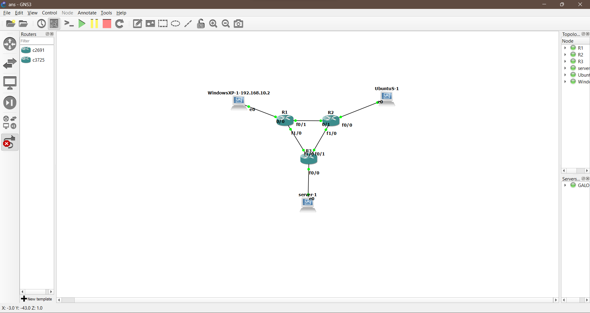
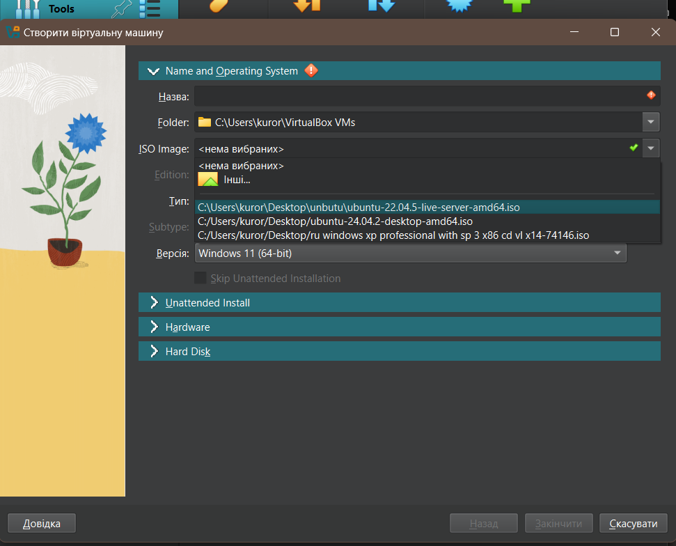
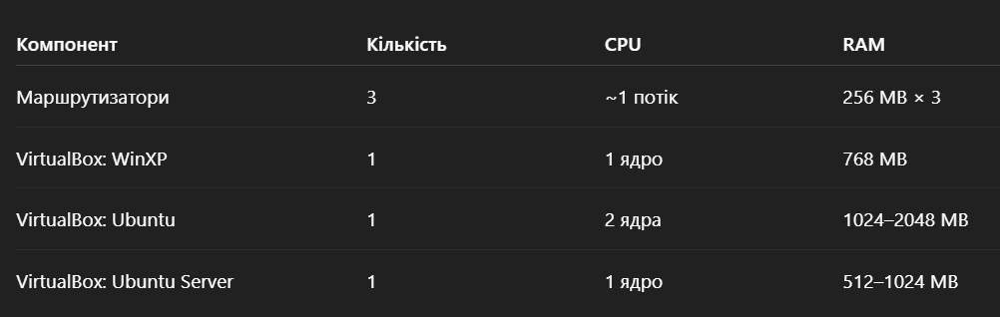
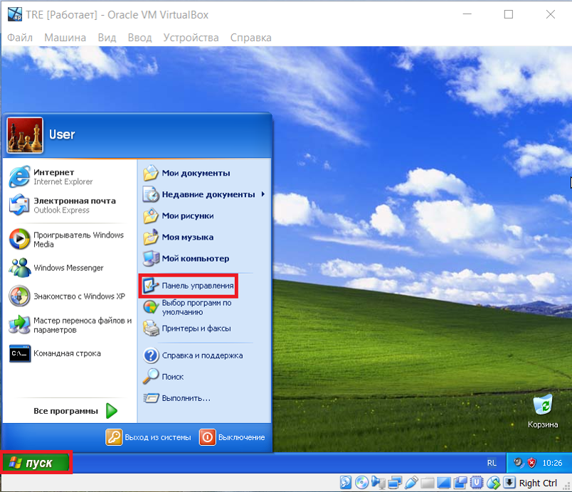
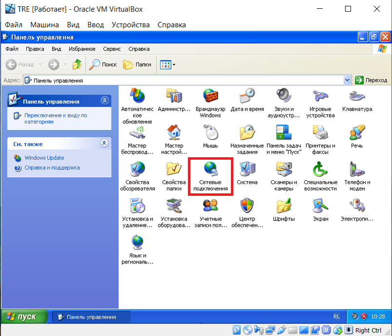
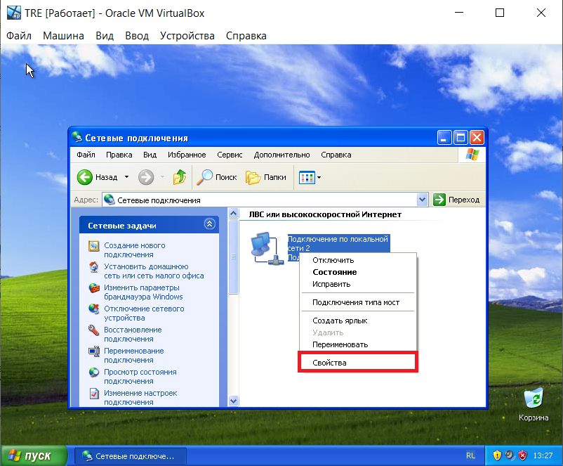
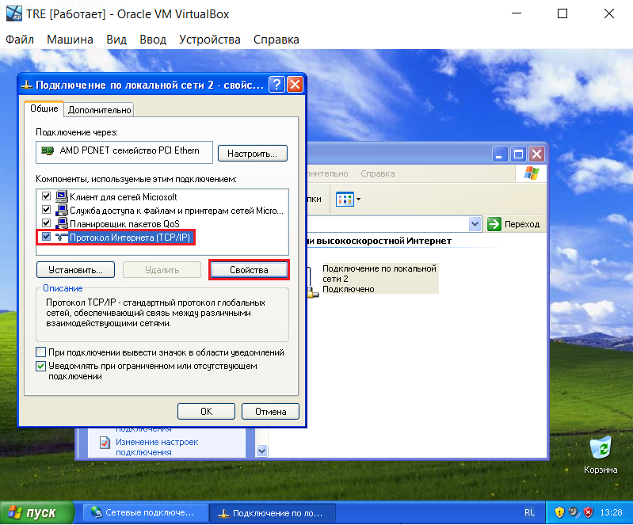
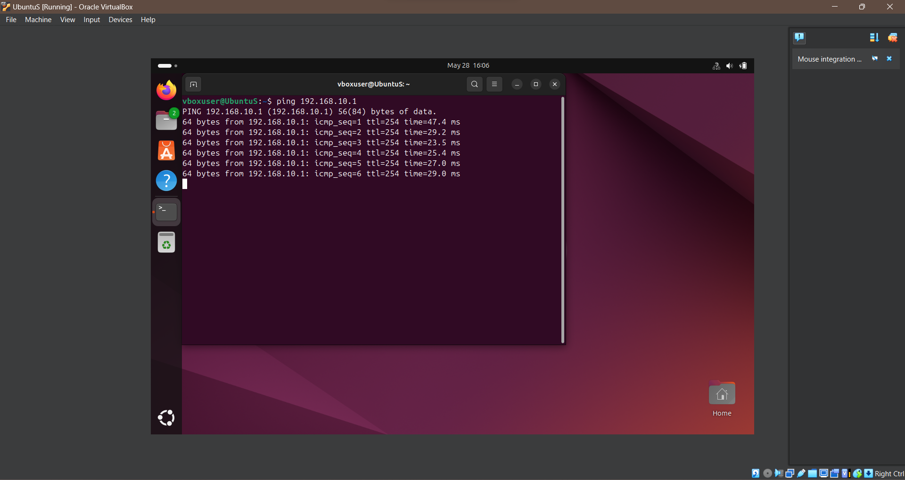
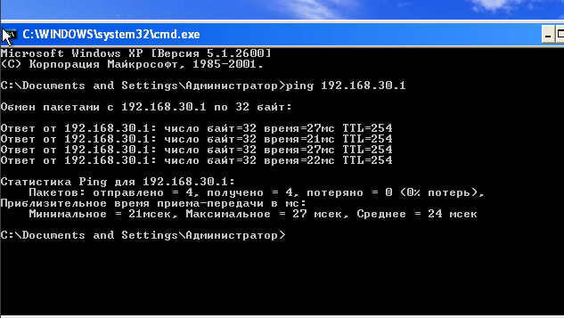

#  Посібник із налаштування маршрутизаторної мережі в GNS3

Створити в GNS3 складну мережу з трьома маршрутизаторами Cisco та трьома віртуальними машинами: Windows XP, Ubuntu Desktop, Ubuntu Server. Впровадити динамічну маршрутизацію за допомогою OSPF із підтримкою резервування маршрутів.

---

## Будуємо схему згідно в програмному середовищі GNS3


Підключаємо пристрої до портів як на схемі

---

## Створення віртуальних машин 
1.Для початку завантажуємо VirtualBox з офіційного сайту https://www.virtualbox.org
 
 **Також** встановлюємо .iso потрібних нам оперційних систем (Windows XP,Ubuntu OS, Ubuntu server)

2.При створенні віртуальних машин вибираємо потрібний нам .iso яке нам потрібно



3.Також не забуваємо правильно налаштувати ресурси машин для коректності роботи системи. На фото показані оптимальні значення які потрібно буде виставити в налаштуваннях


 ---

## Схема мереж:

| Лінк                     | IP-адреси                   | Мережа          |
| ------------------------ | --------------------------- | --------------- |
| WinXP ↔ R1(f0/0)         | 192.168.10.2 ↔ 192.168.10.1 | 192.168.10.0/24 |
| R1(f0/1) ↔ R2(f0/1)      | 192.168.12.1 ↔ 192.168.12.2 | 192.168.12.0/24 |
| R1(f1/0) ↔ R3(f1/0)      | 192.168.13.1 ↔ 192.168.13.2 | 192.168.13.0/24 |
| R2(f0/0) ↔ Ubuntu        | 192.168.20.1 ↔ 192.168.20.2 | 192.168.20.0/24 |з
| R2(f1/0) ↔ R3(f0/1)      | 192.168.23.1 ↔ 192.168.23.2 | 192.168.23.0/24 |
| R3(f0/0) ↔ Ubuntu Server | 192.168.30.1 ↔ 192.168.30.2 | 192.168.30.0/24 |
 

---

#  Налаштування маршрутизаторів (OSPF)

Спочатку вмикаємо потрібний нам маршрутизатор також не забуваємо про ввімкнення функції "Auto IDLE-PC"


### R1
```bash
interface f0/0
 ip address 192.168.10.1 255.255.255.0
 no shutdown
interface f0/1
 ip address 192.168.12.1 255.255.255.0
 no shutdown
interface f1/0
 ip address 192.168.13.1 255.255.255.0
 no shutdown
router ospf 1
 router-id 1.1.1.1
 network 192.168.10.0 0.0.0.255 area 0
 network 192.168.12.0 0.0.0.255 area 0
 network 192.168.13.0 0.0.0.255 area 0
```

### R2
```bash
interface f0/0
 ip address 192.168.20.1 255.255.255.0
 no shutdown
interface f0/1
 ip address 192.168.12.2 255.255.255.0
 no shutdown
interface f1/0
 ip address 192.168.23.1 255.255.255.0
 no shutdown
router ospf 1
 router-id 2.2.2.2
 network 192.168.20.0 0.0.0.255 area 0
 network 192.168.12.0 0.0.0.255 area 0
 network 192.168.23.0 0.0.0.255 area 0
```

### R3
```bash
interface f0/0
 ip address 192.168.30.1 255.255.255.0
 no shutdown
interface f0/1
 ip address 192.168.23.2 255.255.255.0
 no shutdown
interface f1/0
 ip address 192.168.13.2 255.255.255.0
 no shutdown
router ospf 1
 router-id 3.3.3.3
 network 192.168.30.0 0.0.0.255 area 0
 network 192.168.23.0 0.0.0.255 area 0
 network 192.168.13.0 0.0.0.255 area 0
```

---

##  Налаштування віртуальних машин

### Ubuntu (Desktop):

Щоб перейти в термінал використовуємо комбінацію клавіш CTRL+ALT+T

Для початку потрібно дізнатись який у вас мережевий інтерфейс , зазвичай в нових версіях Ubuntu він "enp0s3" але ми можемо перевірити за допомогою команди 
```bash
ip link
```
Після того як ми дізнались мережевий інтерфейс можемо встановити IP, маску та default gateway
```bash
sudo ip addr add 192.168.20.2/24 dev enp0s3
sudo ip link set enp0s3 up
sudo ip route add default via 192.168.20.1
```
 **Перевірка**:
```bash
ping 192.168.20.1
```
--- 

### Ubuntu Server:

```bash
sudo ip addr add 192.168.30.2/24 dev enp0s3
sudo ip link set enp0s3 up
sudo ip route add default via 192.168.30.1
```
**Порада** (опціонально): зберегти налаштування постійно
Щоб IP-адреса і шлюз не зникли після перезавантаження Ubuntu Server, можемо додати їх до Netplan:

1.Відкриваємо Netplan:
```bash
sudo nano /etc/netplan/01-netcfg.yaml
```
2.Змінюємо/додаємо:
```bash
network:
  version: 2
  ethernets:
    enp0s3:
      addresses: [192.168.30.2/24]
      gateway4: 192.168.30.1
      nameservers:
        addresses: [8.8.8.8, 1.1.1.1]
```
3.Застосовуємо:
```bash
sudo netplan apply
```

 **Перевірка:**
```bash
ping 192.168.30.1
```

### Windows XP:
- Вручну задати в параметрах мережі:
  - IP: `192.168.10.2`
  - Маска: `255.255.255.0`
  - Шлюз: `192.168.10.1`
 **Перевірка:**
```bash
ping 192.168.10.1
```
На малюнках показана покрокова інструкція як налаштувати параметри:






---

##  Перевірка зв’язності та OSPF

- Перевірити сусідів OSPF:
```bash
show ip ospf neighbor
```
- Перевірити таблицю маршрутизації:
```bash
show ip route ospf
```
- Пінг із Ubuntu:
```bash
ping 192.168.10.2
ping 192.168.30.2
```

---


##  Результат
Як ми бачимо на ілюстраціях ми пінгуємо машини та маємо проходження пакетів без втрат





(C) Andriy Sadlov, 2025