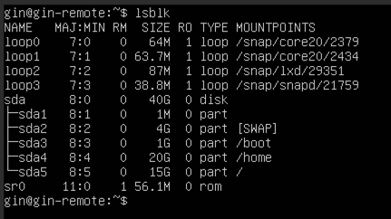

# OS commands helper

# Table of contents
1. [Ubuntu installation](#ubuntu-installation)
2. [User management](#user-management)
3. [File and disk commands](#file-and-disk-commands)
4. [View file content](#view-file-content)
5. [Copy, Move, Delete](#copy-move-delete)
6. [Disk navigation](#disk-navigation)
7. [Make file executable](#make-file-executable)
8. [SSH connection](#ssh-connection)
9. [Copy file via SSH](#copy-file-via-ssh)
10. [Crontab and at](#crontab-and-at)
11. [Record your terminal](#record-your-terminal)
12. [Network troubleshoot](#network-troublleshoot)

## Ubuntu installation

Set `/boot` approximately 0.5 - 1Gb

Set `[SWAP]` equal to your RAM

Set `/home` approximately 60% of total disk

Set `/` all  of the rest space

No empty space left on .


Check disk partitions:

```bash
lsblk
```
should see something like:



## User management

1. Create one more user and make it root

```bash
sudo useradd -m -s /bin/bash vasya
```

`-m` - makes home folder

`-s` - sets the default shell 

This will add user `vasya` to the system.

2. Set password for the user

```bash
sudo passwd vasya
```
Then enter the password

3. OPTIONALLY. you may set password expiration date for the user
```bash
passwd -e vasya 
```

OPTIONALLY : you may install `fish` as your default shell for the user


```bash
sudo apt-get install -y fish
```

To use it: 

add shell in the /etc/passwd for this user 
or edit with usermod:

```bash
sudo usermod -s /usr/bin/fish vasya
```

4. Make user `vasya` root

```bash
usermod -aG sudo vasya
```

Options  means `-a` -- append to `-G` group `sudo` for user `vasya`

Options `-a` and `-G` splits together to `-aG`


check user is root :

```bash
id vasya
```

Should see, that vasya has (sudo) group

### switch between users

switch to user `vasya`

```bash
su vasya
```

Switch to `root` user

```bash
sudo -i
```


## File and disk commands

Create a file:
```bash
touch file.txt
```
Creates empty file if not exist, otherwise updates the timestamp of file access time (atime)

Create a file in text redactor:
```bash
nano file.txt
```

Will open `file.txt` in nano redactor, if file not exist, it will be created.

Starting nano without filename will create empty file, and after editing on exit will ask which filename to save.


Saving file as a result of some command:

```bash
date > date.txt
``` 

Will execute `date` command and save the output to `date.txt` file.


## View file content

Show the content of `file.txt` in the terminal
```bash
cat file.txt
```


Show the first 25 lines of `file.txt`

```bash
head file.txt -n 25
```


Show the last 25 lines of `file.txt`
```bash
tail file.txt -n 25
```


Tail has a beautiful option `-f` which will show the file content in real time, and will update the content if file is updated.

```bash
tail -f log_file.txt
```

Especially useful for logs, when you want to see the updates in real time.

## Copy, Move, Delete

Copy:

`cp <source> <destination>`

Move:

`mv <source> <destination>`

Delete:

`rm path-to-file/file.txt`

Delete recursively:

`rm -r folder/`

Create Folder

`mkdir foldername`


Delete Folder

`rmdir foldername`

## Disk navigation

Change directory (go to some folder)

`cd foldername`

`foldername` is path , when it starts with `/` sign it will be the absolute path. 

If no `/` on the start it will look for the folder (path) in the current directory.

### Make file executable

To make file executable script, it should be modified with `chmod` command

```bash
chmod +x script.sh
``` 

`.sh` extension is not necessary, but it is a good practice to use it for shell scripts

## SSH connection

### Install SSH server
```bash
sudo apt-get install openssh-server
```

### Change SSH port
Edit ssh configuration file:

```bash
sudo nano /etc/ssh/sshd_config
```
In the file change `# Port 22` to `Port 3005` for example , set <30NN> where NN - is your number in Journal

### restart service

```bash
sudo service ssh restart
```

Add rule in the firewall to allow traffic on `3005` port: 

```bash
sudo ufw allow 3005
```

Check firewall settings with `ufw`

```bash
sudo ufw status
```
If you try to connect, error will be shown, because of the ssh is running on another port
```bash
ssh dmytro@172.20.10.6
ssh: connect to host 172.20.10.6 port 22: Connection refused
```
Connect to the server with the new port
```bash
ssh -p 3005 dmytro@172.20.10.6
```

## Copy file via SSH

Use `scp` command to copy files via SSH.

## from remote to local
```bash
scp -P 3005 ssh-admin@192.168.1.105:/home/ssh-admin/host-copy-file.txt ~/programm/tutorials/OS_tutorial 
```

Common syntax is: 
`scp <options> <source> <destination>`

OPTIONS: 

`-P` - (capital P) -- specifies port number

`-r` - copy recursively, e.g. entire folder 

Look closer what `<source>` consist of:

`<username>@<ip_address>:<path>`

`<destination>` -- is path

`~` in the start of the path means home directory of the user

`/` in the start of the path means root directory, absolute path

`./` in the start means current directory

`../` in the start means parent directory


## from local to remote


The same syntax, but source is your local path, and destination is remote.

Notice, source and destination are swapped and splitted with space.

```bash
scp -P 2002 ~/programm/tutorials/OS_tutorial/OS-helper/README.md ssh-admin@192.168.1.105:/home/ssh-admin/
```

## Crontab and at

Watch and check syntax here https://crontab.guru/


First of all check your host machine time:
```bash
date
```
Should see the current time of the host machine, notice if it will have different time zone or different time.

To set the time zone of the VM, use the following command:

```bash
sudo timedatectl set-timezone Europe/Kiev
```

### how to edit crontab

```bash
crontab -e
```

### how to list crontab

```bash
crontab -l
```

Example of the script to run every day at 09:00

```bash
0 9 * * * /bin/bash /home/everyday_video/silence_minute_play.sh
```

### How to run a script at a specific time 

To run `at` in terminal and provide the command to run at a specific time:

```bash
at 09:00
```
Then provide the command to run at this time:

```bash
/bin/bash /home/everyday_video/silence_minute_play.sh
```
To finish editing, press **Ctrl+D**

#### View the scheduled tasks

To view the task that were scheduled with `at` command, use the following command:
```bash
atq
```


#### Remove the scheduled task

To remove the task, use the following command:

```bash
atrm <task_number>
```
The <task_number> you can get from the `atq` command output.


## Record your terminal
To start recording with script, provide two destination files: a timing file and a typescript file:
    
```bash
script --timing=time.tm myscript
```
Script will record all the commands, you perform in terminal, their outputs etc. All you have done will be saved to the `myscript` file, and timing to the `time.tm` file.

To replay the script, use the following command:

```bash
scriptreplay --timing=time.tm myscript
```

You will see the same commands, you have performed in the terminal, and their outputs. 

Magic!


# Network troublleshoot

Example how to set IP address to the interface manually:

```bash
sudo ip addr add 192.168.1.111/24 dev enp0s8
```

IP address should be in the same network as the router (host PC), and the same network mask.