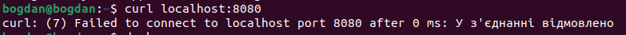
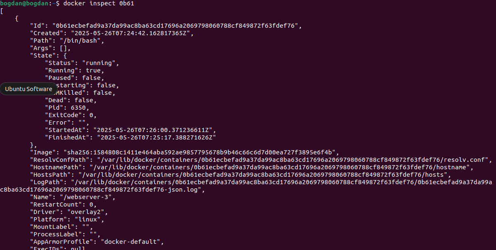
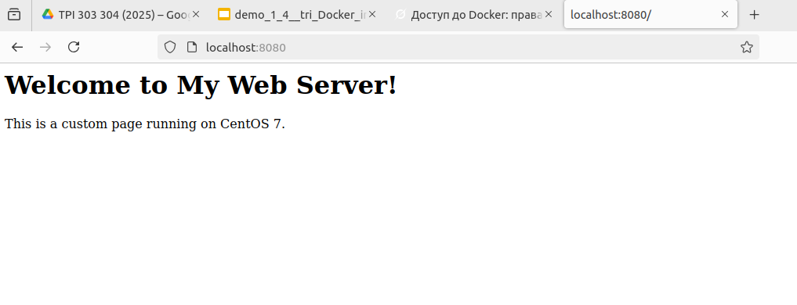

# Посібник із налаштування веб-сервера в Docker

Нотатки по результатам виконання практичної роботи 1.4 (ТРЕ - ТРІС)

## Встановлення веб-сервера Apache

Для встановлення веб-сервера Apache та всіх необхідних залежностей виконайте наступні команди:

```bash
yum update && yum install httpd -y
```

> **Примітка**: Команда `yum update | yum install httpd –y` у вашому документі може бути помилковою, оскільки використання `|` (pipe) тут недоцільне. Правильніше використовувати `&&` для послідовного виконання команд.

## Створення веб-сторінки

Створіть веб-сторінку за шляхом `/var/www/html/index.html`:

```bash
vi /var/www/html/index.html
```

У файлі `index.html` можна додати, наприклад, простий HTML-код:

```html
<!DOCTYPE html>
<html>
<head>
    <title>Тестовий веб-сервер</title>
</head>
<body>
    <h1>Вітаємо! Це тестова сторінка Apache в Docker.</h1>
</body>
</html>
```

## Вихід із контейнера

Щоб вийти з активного контейнера, виконайте команду `exit`. Це зупинить контейнер, подібно до вимкнення комп’ютера:

```bash
exit
```

## Створення власного образу Docker

Після налаштування Apache та веб-сторінки створіть власний образ за допомогою команди `docker commit`:

```bash
docker commit my-webserver webserver:v1
```

> **Примітка**: Переконайтеся, що контейнер із назвою `webserver` існує та працює перед виконанням цієї команди. Ви можете перевірити список контейнерів за допомогою `docker ps -a`.

## Запуск контейнера веб-сервера

Запустіть контейнер із створеного образу за допомогою правильної команди:

```bash
docker run -it --name my-webserver -p 8080:80 webserver:v1 /usr/sbin/httpd -D FOREGROUND
```

### Можливі помилки

1. **Конфлікт імен контейнерів**  
   Якщо контейнер не запустився, він може залишитися в системі, що призведе до помилки при повторному запуску з тією ж назвою. Щоб очистити кеш і видалити всі невикористовувані контейнери:

   ```bash
   docker system prune
   ```

   Для перегляду всіх контейнерів (активних і зупинених):

   ```bash
   docker ps -a
   ```

2. **Неправильна команда**  
   Важливо: прапор `-D FOREGROUND` **обов’язково** вводити у верхньому регістрі (CapsLock). Неправильні приклади:
   - `-d foreground`
   - `-D Foreground`
   - `-d FOREGROUND`

   Правильна команда (повтор для наочності):

   ```bash
   docker run -it --name my-webserver -p 8080:80 webserver:v1 /usr/sbin/httpd -D FOREGROUND
   ```

## Допоміжні інструменти

1. **Перевірка роботи веб-сервера**  
   Відправте HTTP-запит до сервера на локальному порті 8080:

   ```bash
   curl localhost:8080
   ```
    


   Це поверне HTML-код вашої сторінки, якщо сервер працює правильно.

2. **Перегляд інформації про контейнер**  
   Для отримання детальної інформації про контейнер у форматі JSON:

   ```bash
   docker inspect my-webserver
   ```
    

   Замініть `my-webserver` на ім’я або ID вашого контейнера.

## Очікуваний результат

Якщо все налаштовано правильно, відкрийте браузер і перейдіть за адресою `http://localhost:8080`. Ви побачите веб-сторінку, яка відповідає вмісту `index.html`. 

(c) Bogdan Makarenko, 2025