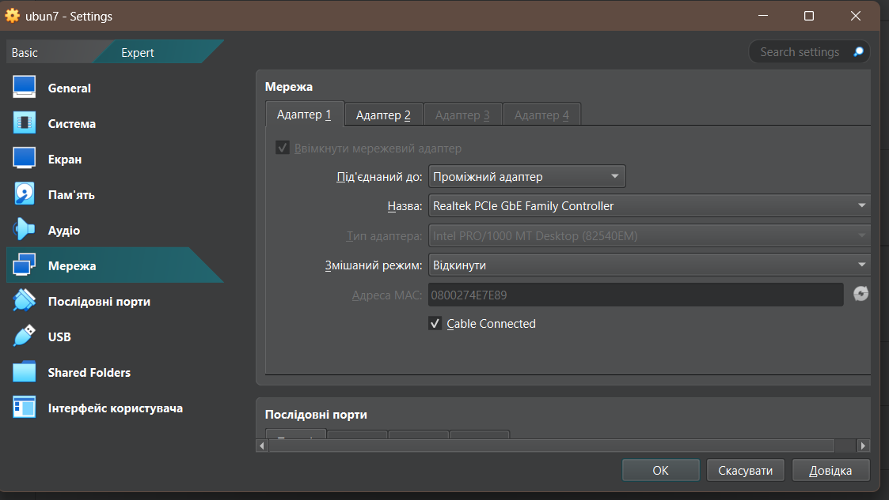
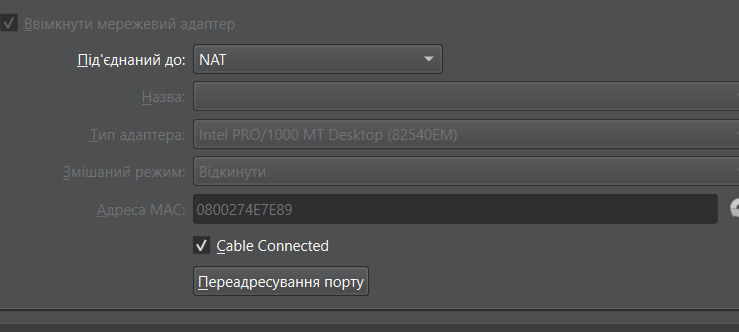
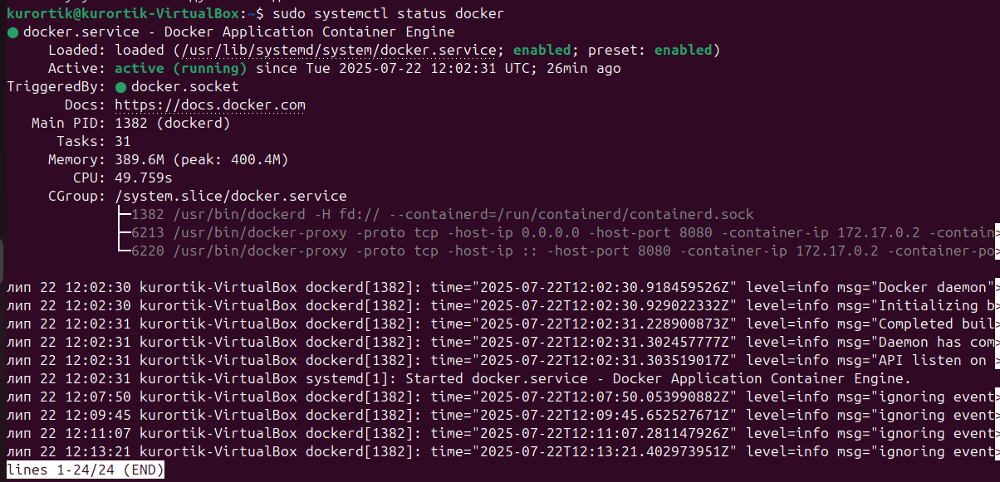
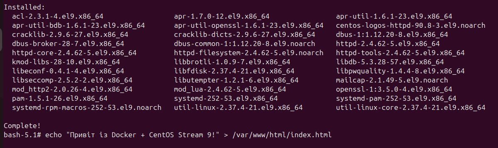
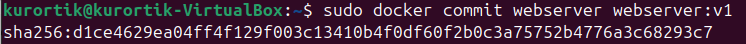
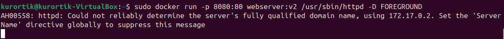
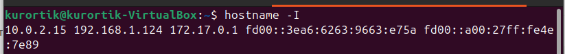
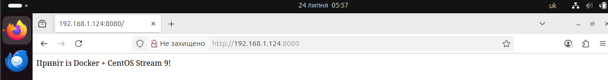

#  Інструкція: Розгортання Apache на Docker (CentOS Stream 9) у VirtualBox

##  1. Встановлення віртуальної машини (Ubuntu)

1. Встанови **VirtualBox**. 
2. Завантаж та встанови **Ubuntu (20.04 або новішу)** та налаштуй її : ОЗУ-2048мб , процессор - 2 потоки та внутрішня память-15гб для виконання завдання вистачить.
3. У налаштуваннях мережі вкажи:
   - Тип: **Мережевий міст (Bridged Adapter)**
   
   - Адаптер: Wi-Fi або Ethernet, в залежності від підключення.
   
   
---

##  2. Встановлення Docker в Ubuntu
Відкриваємо термінал комбінацією Ctrl+Alt+T
```bash
sudo apt update
sudo apt install docker.io -y
sudo systemctl enable docker
sudo systemctl start docker
```

Перевірка:
```bash
sudo systemctl status docker
```
 

---

##  3. Перевірка підключення до Інтернету у разі помилок при завантаженні

```bash
ping google.com
```
---
### У разі втрати пакетів перевір підключення другого адаптеру "NAT" або тимчасово зміни перший в налаштуваннях **VirtualBox**
---

##  4. Завантаження образу CentOS Stream 9

```bash
sudo docker pull quay.io/centos/centos:stream9
```

---

##  5. Створення контейнера з CentOS + DNS

> Видалити попередній контейнер, якщо існує:
```bash
sudo docker rm webserver
```

> Запустити новий контейнер:
```bash
sudo docker run -it --name webserver --dns=8.8.8.8 quay.io/centos/centos:stream9
```

---

##  6. Всередині контейнера: встановлення Apache та створюємо HTML файл

```bash
dnf install httpd -y
echo "Привіт із Docker + CentOS Stream 9!" > /var/www/html/index.html
exit
```

### В лапках пишемо потрібний нам текст  
---

##  7. Збереження контейнера як образу

```bash
sudo docker commit webserver webserver:v1
```

---

##  8. Запуск контейнера з відкритим портом

```bash
sudo docker run -p 8080:80 webserver:v1 /usr/sbin/httpd -D FOREGROUND
```

---

##  9. Перевірка через браузер 

1. Дізнатися IP-адресу Ubuntu:
```bash
hostname -I
```

### Наша IP адреса 192.168.1.124, якщо IP адреса Bridge adapter не відображається перевір порти у разі їх зміни обов`язково перезавантаж систему.
2. У браузері Windows відкрити:
```
http://<IP>:8080
```

---
## Якщо все працює , вітаю ти впорявся з завданням🎉🎉🎉
##  10. Якщо не працює:

- Перевірити, що мережа VirtualBox — **"Мережевий міст"**.
- Вимкнути фаєрвол:
```bash
sudo ufw disable
```
- Дозволити порт 8080:
```bash
sudo ufw allow 8080
```

---

##  11. Основні команди Docker

- Перегляд запущених контейнерів:
```bash
sudo docker ps
```

- Зупинка контейнера:
```bash
sudo docker stop <container_id>
```

- Видалення контейнера:
```bash
sudo docker rm <container_id>
```

---

##  12. Редагування сторінки (2 способи)

### 1. Через Bash:
```bash
sudo docker run -it --name webserver-edit webserver:v1 /bin/bash
echo "Новий текст сторінки" > /var/www/html/index.html
exit
sudo docker commit webserver-edit webserver:v2
sudo docker run -p 8080:80 webserver:v2 /usr/sbin/httpd -D FOREGROUND
```

### 2. Через копіювання файлу з хосту:
```bash
echo "Оновлений текст" > index.html
sudo docker cp index.html <container_id>:/var/www/html/index.html
```

---

##  13. Видалення образу

```bash
sudo docker rmi webserver:v1
```

---

##  Результат

У браузері Windows відкривається:
```
http://192.168.X.X:8080
```
і показує:
```
Привіт із Docker + CentOS Stream 9!
```
